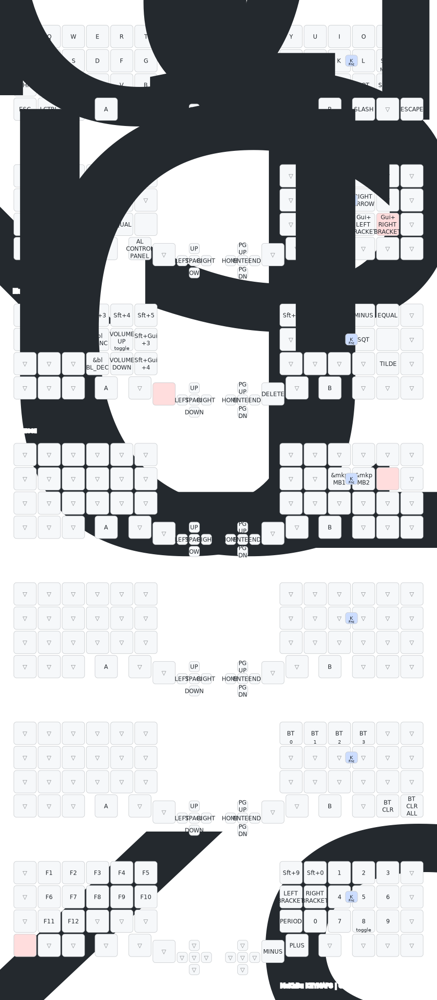

# Futhesia Moduora (MeKaBu) - フセシア・モデュオラ（メカブ）

```
                                                                                         
                                :-:                                                      
                               =@@@%=                                                    
                               .#@@@@%-                                                  
                                 =@@@@@=         :%%#:                                   
                    :*#*:         :@@@@@-        *@@@%                                   
                    +@@@@#.        +@@@@#        %@@@%                                   
                     =@@@@@-       -@@@@%       +@@@@*                                   
                      .#@@@@=      -@@@@%     .#@@@@%.                                   
                        #@@@@.     #@@@@=    =@@@@@%:                                    
                        :@@@@=    *@@@@*   -%@@@@@*                                      
                        :@@@@=   *@@@@#   +@@@@@*:   -#%#-                               
                        =@@@@.  =@@@@#   #@@@@#:    -@@@@%                               
                        *@@@#   %@@@@.  *@@@@=    .=@@@@@=                               
                        %@@@*   @@@@*  -@@@@-   :*%@@@@@=                                
                        #@@@#   #@@@=  #@@@=  .#@@@@@#+.                                 
                        =@@@@-  -@@@+  %@@*  :@@@@#=.                                    
         --.             +@@@@:  +@@%  #@@: :@@@#:                .--                    
       .%*=%*=======:     -%@@@=  *@@- *@@  %@@-      -==========*%+*%.                  
       :@*-%#++++++*@#.     -#@@#: #@# =@% +@%:     -%%++++++++++#@-+@:                  
        .==:        .*@+      :+@@= %@:-@*.@%.    .*@=            :==.                   
           .:         :#%=      .+@+-@*=@=#%.    +@*.            :.                      
         .%**%=-----:   -%#---:   +@*%%%@%@:  :=%#:   :--------=%**%:                    
         -@=-@#*****%#:   =***#%+*@@@@@@@@@%+#%*-   -%%********#@--@=                    
          :++-       +@#:      .+@@@@@@@@@@@*-    :#%=          -++-                     
                      .*@#*******%@@@@@@@@@@*****#@+                                     
                        .:::::::::::::::::::::::::.                                      
                                                                                         
```

A distributed knowledge-type input device discovered in Realm of Split IV.  
分割界・第四層で発見された集合知式入力装置群

## Classification | 分類
- **Species**: Synaptica Modularis (集合知式入力装置群)
- **Common Name**: MeKaBu (メカブ)
- **Origin**: Realm of Split IV (分割界・第四層)
- **Distribution**: Personal Workshops & Community Development Zones (個人工房、コミュニティ開発圏)
- **Nature**: Extensible, Autonomous, Harmonious (拡張可能・自律型・協奏性)

## Overview | 概要
Futhesia Moduora is an intellectually and structurally evolving input device born from the collective knowledge and experience of multiple developers. While based on a split-grid input surface, its form can be freely altered through external modules (known as Nodes).

フセシア・モデュオラは、複数の開発者が知識と経験を持ち寄ることによって生まれた、知的・構造的進化を続ける入力装置である。その外見は、左右に分かれた格子状の入力面を基軸としながらも、外部モジュール（通称：Node）によって自在に形を変える。

## Key Features | 特徴
- **Cognitive Lattice (知の格子)**: Key layouts designed at the intersection of functional beauty and logic
- **Modular Nexus (拡張構造)**: Freely interchangeable pointing devices, encoders, and sensors
- **Resonant Evolution (共鳴型進化)**: Organic integration of developer codes and designs
- **Tectonic Mode (テンティング適応)**: Physically adaptable form-factor

## Natural Habitat | 生態／運用環境
Thrives in collaborative environments, particularly hackathons and technical conventions.
単体での生息よりも、共創型の環境下において最も高いパフォーマンスを発揮する。

### Current Keymap Configuration | 現在のキーマップ構成


## Technical Notes | 技術仕様メモ

### Shared-Pin Mode Mux (P0.11 / P0.12)
- P0.11 / P0.12 を `SPI` / `I2C` / `QDEC(Encoder)` で排他的に共有します。
- 対象デバイスはすべて `status = "okay"` のまま定義し、起動時はダミー pinctrl を適用します。
- 実際の物理ピン割り当ては `mode_manager` が起動時に設定を読んで適用します。
- モード値は Zephyr `settings` に永続化されます。
  - `0`: SPI
  - `1`: I2C
  - `2`: QDEC

関連ファイル:
- `boards/shields/MKB/MKB_L_Base.overlay`
- `boards/shields/MKB/MKB_R_Base.overlay`
- `/zmk-workspace/zmk-module-shared-mode-mux/src/mode_manager.c`
- `/zmk-workspace/zmk-module-shared-mode-mux/src/behaviors/behavior_set_mode.c`
- `/zmk-workspace/zmk-module-shared-mode-mux/dts/behaviors/set_mode.dtsi`
- `/zmk-workspace/zmk-module-shared-mode-mux/dts/bindings/behaviors/zmk,behavior-set-mode.yaml`
- `/zmk-workspace/zmk-module-shared-mode-mux/zephyr/module.yml` (`dts_root: .`)

補足:
- このリポジトリ内の `dts/behaviors/set_mode.dtsi` / `dts/bindings/*` は参照せず、外部モジュール側定義を利用します。

### Unified Firmware (段階移行)
モジュール別ファームを維持しつつ、共有ピン系モジュールを統合したターゲットを追加しています。

- Left: `MKB_L_Base + MKB_L_UNI`
- Right: `MKB_R_Base + MKB_R_UNI`

`build.yaml` の `artifact-name`:
- `MKB_L_UNIFIED`
- `MKB_R_UNIFIED`

### `&sm` Behavior (モード切替コマンド)
`config/MKB.keymap` の BT レイヤーで利用します。

- `&sm 0..2`: ローカル側のみ切替
  - `0=SPI`, `1=I2C`, `2=QDEC`
- `&sm 10..12`: リモート側（split peripheral）のみ切替
  - `10=SPI`, `11=I2C`, `12=QDEC`
- `&sm 20..22`: ローカル + リモートの両方を同時切替
  - `20=SPI`, `21=I2C`, `22=QDEC`

実行時の動作:
1. 対象側でモードを保存 (`settings_save_one`)
2. 必要に応じて central から peripheral へ relay event 送信
3. 反映後に再起動 (`sys_reboot(SYS_REBOOT_COLD)`)

### 運用上の注意
- 左右で異なるモジュールを使う場合、`&sm` は左右個別（ローカル/リモート）で操作してください。
- I2C の pull-up は pinctrl 側でのみ管理します。
- SPI はモード切替時に不要な干渉を避けるため、非選択デバイスを suspend します。

## Etymology | 語源
The name "MeKaBu" encompasses multiple meanings:
- Mechanical Components (メカニカルな部品群)
- Sprouting Stock - branching growth structure (芽株 - 分岐して増殖する構造)

---
*This configuration exists in the liminal space between reality and digital dreams.*  
*この設定は、現実とデジタルの夢の間の境界に存在する。*
